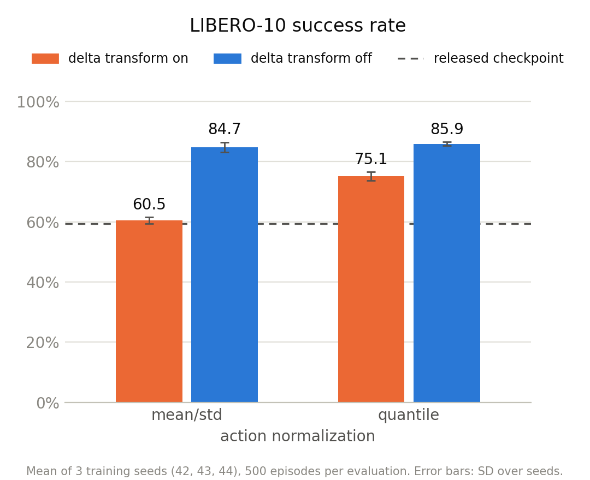
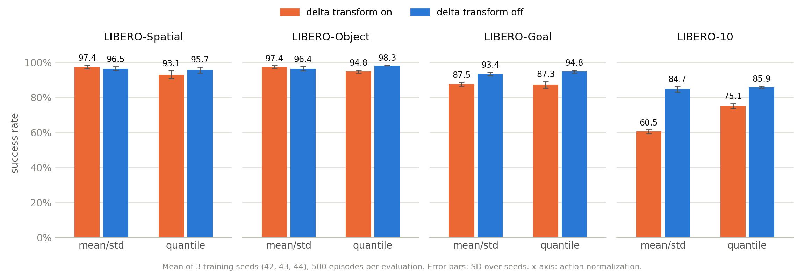

# libero-delta-ablation

Trains and evaluates π0-FAST on LIBERO with openpi's own code, in four configs that differ only in the
delta-action transform and the action normalization:

| config | delta transform | normalization |
|---|---|---|
| `pi0_fast_libero` | on | mean/std |
| `pi0_fast_libero_no_delta` | off | mean/std |
| `pi0_fast_libero_quantile` | on | quantile |
| `pi0_fast_libero_no_delta_quantile` | off | quantile |

openpi is a submodule at commit `215abfb`. Setup applies the two files in `patches/` to it: openpi
PR #971 and the three extra configs.

## Results

Three training seeds (42, 43, 44) per config. Each evaluation runs `examples/libero/main.py` with 50
trials per task, 500 per suite. Success rate in %, mean ± standard deviation over the three seeds.

| config | delta transform | normalization | LIBERO-Spatial | LIBERO-Object | LIBERO-Goal | LIBERO-10 |
|---|---|---|---|---|---|---|
| `pi0_fast_libero` | on | mean/std | 97.4 ± 1.1 | 97.4 ± 0.7 | 87.5 ± 1.2 | 60.5 ± 1.0 |
| `pi0_fast_libero_no_delta` | off | mean/std | 96.5 ± 1.2 | 96.4 ± 1.3 | 93.4 ± 1.1 | 84.7 ± 1.7 |
| `pi0_fast_libero_quantile` | on | quantile | 93.1 ± 2.2 | 94.8 ± 0.9 | 87.3 ± 1.8 | 75.1 ± 1.5 |
| `pi0_fast_libero_no_delta_quantile` | off | quantile | 95.7 ± 1.7 | 98.3 ± 0.1 | 94.8 ± 0.9 | 85.9 ± 0.6 |

LIBERO-10 per seed, and the released `pi0_fast_libero` checkpoint evaluated with the same setup:

| config | seed 42 | seed 43 | seed 44 |
|---|---|---|---|
| `pi0_fast_libero` | 59.6 | 61.6 | 60.2 |
| `pi0_fast_libero_no_delta` | 85.6 | 82.8 | 85.8 |
| `pi0_fast_libero_quantile` | 76.2 | 73.4 | 75.6 |
| `pi0_fast_libero_no_delta_quantile` | 86.2 | 86.2 | 85.2 |
| released `pi0_fast_libero` checkpoint | 59.4 | | |





Raw evaluation output is in `results/<config>_s<seed>/<suite>/`: `client.log` is the log of
`examples/libero/main.py` with the outcome of every episode, and `result.json` holds the overall and
per-task success rates parsed from it. The released checkpoint's evaluation is in
`results/released/libero_10/`. To redraw the figures and reprint the tables:
`uv run --frozen --project third_party/openpi python scripts/plot_results.py`.

## Requirements

- A SLURM cluster with GPUs. The job scripts are set up for the Yale Bouchet cluster (partition
  `gpu_rtx6000`, RTX PRO 6000 with 96 GB). On another cluster, adjust the `#SBATCH` lines and put
  paths and module names in an untracked `env.local.sh`, which `env.sh` sources.
- A Hugging Face account, for downloading the training data.

## Run

Run everything from the repository root.

```bash
git clone --recurse-submodules <repo-url> libero-delta-ablation
cd libero-delta-ablation

# 1. Build the openpi and LIBERO client environments and apply the patches
sbatch slurm/setup.sbatch

# 2. Log in to Hugging Face once, then download the training data (about 35 GB)
source env.sh
uv run --frozen --project third_party/openpi huggingface-cli login
sbatch slurm/download_data.sbatch

# 3. Train, 30,000 steps: about 26 hours per config on one RTX PRO 6000
configs="pi0_fast_libero pi0_fast_libero_no_delta pi0_fast_libero_quantile pi0_fast_libero_no_delta_quantile"
for c in $configs; do sbatch slurm/train.sbatch "$c" s42 42; done

# 4. Evaluate the final checkpoints on the four LIBERO suites, 50 trials per task
for c in $configs; do
  for suite in libero_spatial libero_object libero_goal libero_10; do
    sbatch slurm/eval.sbatch "$c" "$CHECKPOINT_BASE_DIR/$c/s42/29999" "$suite" "${c}_s42"
  done
done
```

The normalization statistics are already in `assets/`. To recompute them after the download:
`sbatch slurm/norm_stats.sbatch <config>`.

For another seed, replace `s42 42` with, for example, `s43 43` in step 3 and `s42` with `s43` in
step 4. Resubmitting a training job with the same arguments resumes from its last checkpoint.

To check the setup against the released checkpoint (about 60% on LIBERO-10):

```bash
sbatch slurm/eval.sbatch pi0_fast_libero gs://openpi-assets/checkpoints/pi0_fast_libero libero_10 released
```

## Output

- Checkpoints: `$CHECKPOINT_BASE_DIR/<config>/<exp-name>/` (on scratch, set in `env.sh`)
- Evaluation: `results/<tag>/<suite>/` with `result.json` (overall and per-task success rate),
  `client.log`, and, not tracked in git, `server.log` and episode videos
- Job logs: `logs/`
